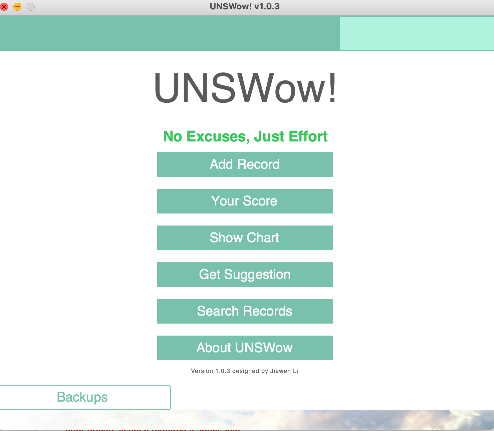
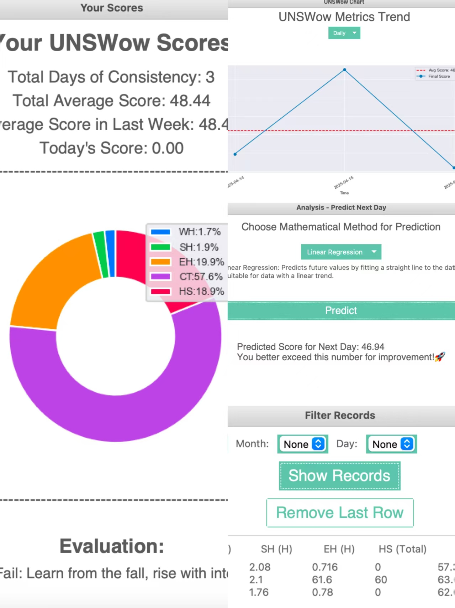
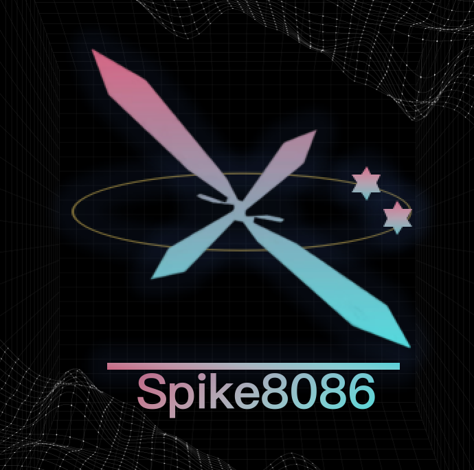

# UNSWow - Your Personal Growth Tracker for UNSW Students

Wowww! UNSWow is an **unofficial** offline application crafted with care for students of the University of New South Wales (UNSW), but its benefits extend to anyone seeking to track and improve their daily habits and productivity.

UNSWow is designed to help you monitor your personal behaviors and actions, providing insightful feedback and motivation to enhance your daily routines. Don't let the single-script nature fool you – it's built to be robust and functional! 

## Key Features

* **Daily Score in UK Grade Style:** Get a unique score reflecting your daily activities, presented in a familiar UK grading system format.
* **Next-Day Prediction:** Utilize basic mathematical analysis to get a baseline prediction for your next day's score, helping you aim for improvement.
* **Dynamic Day/Night Themes:** Enjoy a visually appealing experience with automatic theme switching based on the time of day.
* **Comprehensive Activity Tracking:** Effortlessly log your work hours, study hours, exercise time, and various health-related activities.
* **Visual Progress & Motivation:** Track your progress through insightful charts and stay inspired with randomly displayed motivational quotes.
* **Efficient Record Filtering & Detailed Evaluations:** Easily search through your records based on date and receive vivid evaluations of your daily performance.

## Important Notes(how to use it)
The applications still not get packed, please run python file **operations.py** for use.
This software is provided **100% free** and is intended for **non-commercial personal use only.** Any commercial exploitation is strictly prohibited,or at least encourage to do so.
When you first open the application, it has 3 samples for ensure could have brief overview for user, if user wanna get rid of sample data that for illustrations, they could simply (Get into the Menu->Click Search Record option->Click "Remove Last Row", do it in three times.)

## Feedback & Issues

For any feedback, bug reports, or suggestions, please feel free to contact the author (still be a student,please be understand might cannot reply on-time) at: jiawen.li12@student.unsw.edu.au

## Personal Profile

Google Scholar: https://scholar.google.com/citations?user=3AHRFwEAAAAJ&hl=en

Bilibili: https://space.bilibili.com/132795674

---
